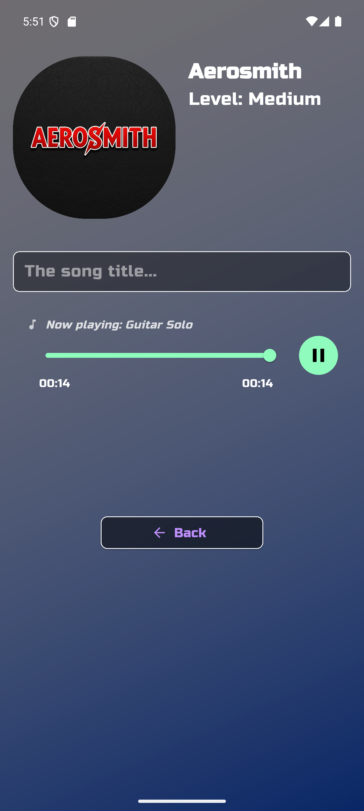
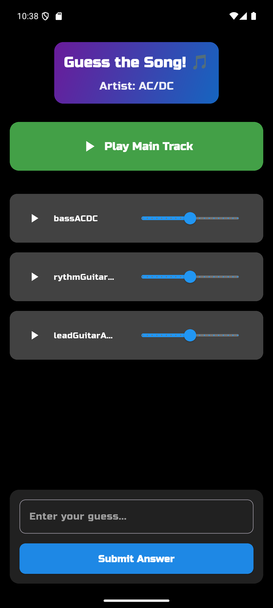
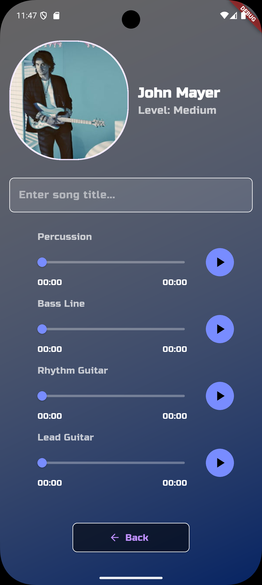

# 🎵 Songs Guesser - Multi-track Music Guessing Game

A full-stack music guessing game where players listen to individual instrument tracks and guess the song title.

## 📱 Project Architecture

This project consists of two main repositories:

### 🎨 **Frontend - Flutter Mobile App**
- **Repository:** [songs-guesser](https://github.com/adamalama151212-code/songs-guesser) *(current repo)*
- **Tech Stack:** Flutter, Dart, audioplayers
- **Features:** 
  - Multi-instrument audio playback (drums, bass, rhythm/lead guitar)
  - Artist selection with custom images
  - Responsive UI with gradient design
  - Real-time audio controls

### 🔧 **Backend - REST API Server**
- **Repository:** [songs-guesser-api](https://github.com/adamalama151212-code/songs-guesser-api)
- **Tech Stack:** Python Flask, SQLite, Docker, Docker Compose
- **Features:**
  - RESTful API for song management
  - Artist and song metadata handling
  - SQLite database for lightweight data storage
  - Docker containerization with docker-compose
  - Python Flask web framework

## 🎮 How It Works

1. **Select Artist** - Choose from various rock/pop artists (AC/DC, Queen, John Mayer, etc.)
2. **Pick Difficulty** - Select game difficulty level (soon...)
3. **Listen & Guess** - Play individual instrument tracks and guess the song
4. **Multi-track Audio** - Each song has separate tracks for percussion, bass, rhythm guitar, and lead guitar

## 📦 Audio Storage with CloudFlare R2

All multi-track audio files (`.mp3`) are hosted on CloudFlare. This ensures reliable streaming and proper versioning of large audio files.

## � Quick Start

### Frontend (Flutter App)
```bash
git clone https://github.com/adamalama151212-code/songs-guesser.git
cd songs-guesser
flutter pub get
flutter run
```

### Backend (Flask API Server)
```bash
git clone https://github.com/adamalama151212-code/songs-guesser-api.git
cd songs-guesser-api
docker-compose up --build
# API will be available at http://localhost:5000
```

## 🛠️ Technical Highlights

- **Clean Architecture:** Modular widget system with reusable components
- **Audio Optimization:** Lightweight audio service without over-engineering
- **Responsive Design:** Consistent UI across different screen sizes
- **Flask API:** RESTful endpoints for song and artist management
- **SQLite Integration:** Lightweight database for metadata storage
- **Docker Deployment:** Full containerization with docker-compose
- **Professional Git Workflow:** Separate repositories for frontend and backend

## 📸 Screenshots



Level functionality still in progress...

Score Screen still in progress...

## 🎯 For Recruiters

This project is not finished but, demonstrates:

- **Full-stack development** skills (Flutter + Flask API)
- **Mobile app development** with Flutter/Dart
- **RESTful API design** with Python Flask
- **Database integration** with SQLite
- **Docker containerization** and docker-compose orchestration
- **Clean code architecture** and project organization
- **Git workflow** and repository management
- **Audio streaming** and real-time audio controls

### 💼 **Perfect for CV:**
```
🎵 Songs Guesser - Full Stack Music Game
Frontend (Flutter): github.com/adamalama151212-code/songs-guesser
Backend (Flask+Docker): github.com/adamalama151212-code/songs-guesser-api
• Multi-track audio streaming • RESTful API • Docker deployment • SQLite database
```

## 🛠️ Tech Stack Summary

| Component           | Technology                  |
|---------------------|-----------------------------|
| **Frontend**        | Flutter, Dart, audioplayers |
| **Backend**         | Python Flask, SQLite        |
| **Containerization**| Docker, Docker Compose      |
| **Audio Storage**   | GitHub raw files            |
| **Database**        | SQLite                      |
| **API**             | RESTful endpoints           |
| **Audio Processing**| Moises.ai (track separation)|

## 🎵 Audio Production Workflow

The multi-track audio files were created using professional audio processing:

- **🎤 Source:** Original songs from artists (AC/DC, Queen, John Mayer, etc.)
- **🔧 Processing:** [Moises.ai](https://moises.ai) - AI-powered audio track separation
- **📁 Output:** Individual instrument tracks:
  - `percussion[SongName].mp3` - Drums and percussion
  - `bass[SongName].mp3` - Bass guitar and low frequencies  
  - `rhythm[SongName].mp3` - Rhythm guitar and chords
  - `lead[SongName].mp3` - Lead guitar and solos
- **☁️ Storage:** GitHub raw files for reliable streaming

This approach allows players to hear individual instrument parts, making the guessing game both educational and entertaining for music enthusiasts.

## Instalacja

1. Zainstaluj Flutter SDK
2. Sklonuj repozytorium
3. Uruchom: `flutter pub get`
4. Uruchom backend API (Flask)
5. Uruchom aplikację: `flutter run`

## Backend API

Backend wymaga Flask servera z endpointami:
- `/artists` - lista artystów
- `/songs/by-artist` - piosenki dla konkretnego artysty
- `/songs/all-by-artist` - wszystkie piosenki artysty
- `/songs/isolated-tracks` - zwraca nazwy plików audio dla każdego instrumentu (percussion, bass, rhythm, lead), potrzebne do zbudowania linku do pliku na GitHub LFS

Pliki audio hostowane na GitHub w formacie: `[instrument][songname].mp3`


**Note:** 


Selected elements of this project (audio service logic, error handling, UI refactoring, and code optimizations) were created with the support of generative AI